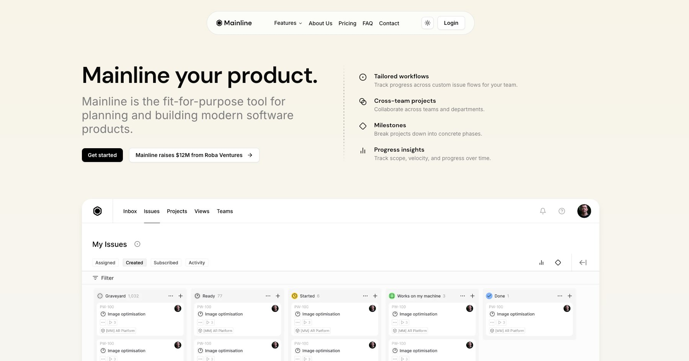

# Eaysin Mia - Full Stack Developer Portfolio

A modern, responsive portfolio website showcasing the work and experience of Eaysin Mia, a Full Stack Developer specializing in React, Node.js, and modern web technologies.

- [Portfolio](https://eaysinmia.dev/)
- [GitHub](https://github.com/meet-eaysin)
- [LinkedIn](https://www.linkedin.com/in/meet-eaysin/)



## Getting Started

```bash
npm install
```

```bash
npm run dev
```

Open [http://localhost:3000](http://localhost:3000) with your browser to see the result.

## About Eaysin Mia

**Full Stack Developer** with 2+ years of experience building scalable web applications using modern technologies.

### Technical Expertise
- **Frontend**: React.js (19+), Next.js, TypeScript, JavaScript (ES6+)
- **Backend**: Node.js, Express.js, MongoDB, PostgreSQL, Prisma
- **State Management**: Redux, Zustand
- **APIs**: RESTful APIs, GraphQL, JWT Authentication
- **Tools**: Docker, Git, Testing & Debugging, Socket.io
- **Cloud**: AWS, Vercel, CI/CD practices

### Professional Experience
- **Full Stack Developer** at Next Level Media (Bangladesh Branch) - Leading ERP development with MERN Stack
- **Software Engineer** at BlackRock IT Solutions - Healthcare staff scheduling system
- **Frontend Developer** at Excel Technologies Ltd. - SmartCare Pro healthcare platform

### Featured Projects
- **Second Brain**: Note-taking application with multiple view types
- **React Form Interactions**: Reusable React library for form validation
- **TechConnect**: Employee management platform

## Portfolio Features

### Core Technology Stack
- **Next.js 15** with App Router
- **Tailwind CSS 4** for styling
- **shadcn/ui** components
- **TypeScript** support
- **React 19**

### Key Features
- **Responsive Design**: Mobile-first approach with perfect mobile experience
- **Dark/Light Theme**: System-aware theme switching
- **SEO Optimized**: Structured data, meta tags, and performance optimized
- **Image Fallbacks**: Graceful error handling for missing images
- **Contact Form**: Functional contact form with validation
- **Testimonials**: Professional recommendations from colleagues
- **Blog Section**: Ready for technical writing and insights
- **Accessibility**: WCAG compliant with proper ARIA labels

### Portfolio Sections
- **Hero**: Professional introduction with skills and contact info
- **Experience**: Detailed work history with company logos
- **Projects**: Featured projects with GitHub links and live demos
- **Testimonials**: Professional recommendations
- **Blog**: Technical articles and insights
- **Contact**: Contact form and information
- **About**: Detailed background and education

### Technical Implementation
- **Server Components**: Optimized with Next.js App Router
- **Client Components**: Strategic use for interactivity
- **Image Optimization**: Next.js Image component with fallbacks
- **Form Validation**: React Hook Form with Zod schemas
- **Type Safety**: Full TypeScript implementation
- **Performance**: Optimized bundle size and loading

## Project Structure

```
eaysin-portfolio/
├── public/
│   ├── favicon/          # Favicon files
│   ├── fonts/            # DM Sans font files
│   ├── logos/            # Company logos
│   ├── testimonials/     # Testimonial images
│   └── og-image.jpg      # Open Graph image
├── src/
│   ├── app/              # Next.js App Router pages
│   │   ├── about/        # About page
│   │   ├── blog/         # Blog pages
│   │   ├── case-studies/ # Case studies page
│   │   ├── contact/      # Contact page
│   │   ├── faq/          # FAQ page
│   │   ├── login/        # Login page
│   │   ├── pricing/      # Pricing page
│   │   ├── privacy/      # Privacy policy
│   │   └── signup/       # Signup page
│   ├── components/
│   │   ├── blocks/       # Page section components
│   │   │   ├── about.tsx
│   │   │   ├── blog.tsx
│   │   │   ├── contact.tsx
│   │   │   ├── experience.tsx
│   │   │   ├── footer.tsx
│   │   │   ├── hero.tsx
│   │   │   ├── navbar.tsx
│   │   │   ├── projects.tsx
│   │   │   └── testimonials.tsx
│   │   ├── ui/           # Reusable UI components
│   │   └── background.tsx
│   ├── lib/              # Utility functions
│   └── styles/           # Global styles
├── package.json
├── tailwind.config.ts
├── next.config.ts
└── README.md
```

## Deployment

Production-ready and tested for deployment on [Vercel](https://vercel.com)

## Contact

**Eaysin Mia**
- Email: meet.eaysin@gmail.com
- Phone: (+880) 1643-226078
- Location: Rajshahi, Dhaka, Bangladesh
- [GitHub](https://github.com/meet-eaysin)
- [LinkedIn](https://www.linkedin.com/in/meet-eaysin/)

## Credits

This portfolio is built using the Mainline template by [shadcnblocks.com](https://shadcnblocks.com)

- Template by [shadcnblocks.com](https://shadcnblocks.com)
- Design by [Callum Flack](https://x.com/callumflack)
- Dev by [Yassine Zaanouni](https://x.com/YassineZaanouni)
- Produced by [Rob Austin](https://x.com/ausrobdev)
- Portfolio Owner: **Eaysin Mia**
